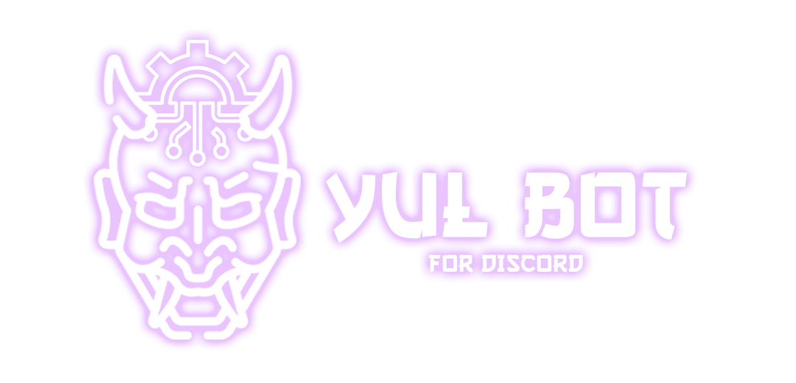

<h1 align="center">YulBot Base</h1>

## ☕ Como usar

```sh
[Baixando]
```
  - Crie o BOT em [Discord Developers](https://discord.com/developers/)
  - Clone ou baixe os arquivos `git clone https://github.com/Enzzzzz/Yulbot-Template-V14` 
  - Utilize `cd YulBot-Template-V14` para entrar na pasta caso tenha dado clone
  - Baixe as dependências com `npm install`
  - Copie o `.env.example` para `.env` e configure-o
```sh
[.env]
```
  - TOKEN= Token do Bot
  - CLIENT_ID= ID do Bot
  - OWNER=Seu ID.
  - DATABASE= URL da Database ( MongoDB )
```sh
[Ligando]
```
  - Utilize `node .` no terminal.


## 📬 Contato
 - Em caso de erros relacionado ao `BOT` Acesse o site e entre no servidor de Suporte. Estarei atendendo lá!
### https://yulbot.vercel.app
 - Observação: Me mencione no chat e aguarde a resposta.
